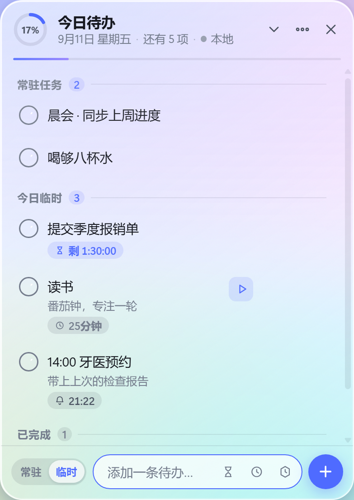
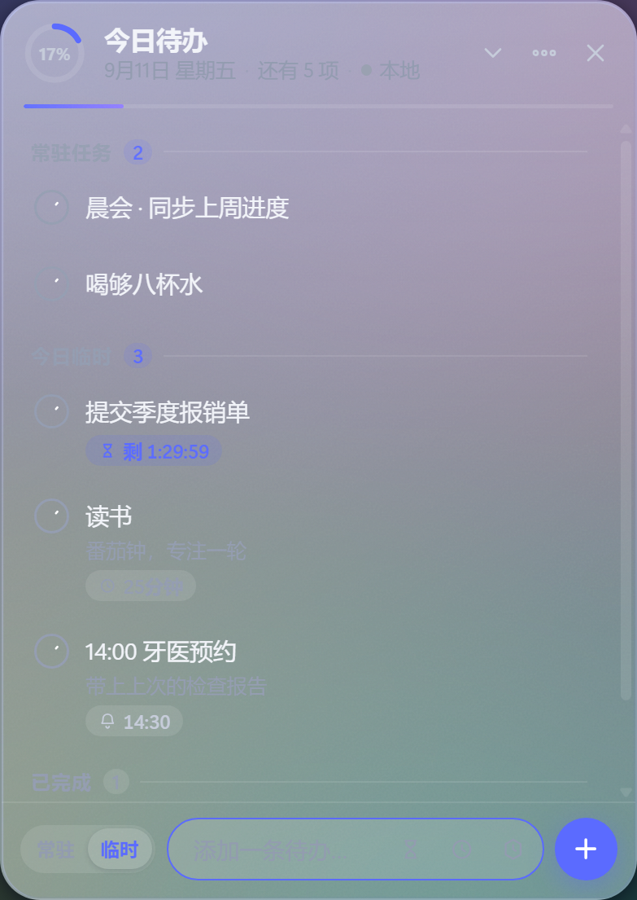
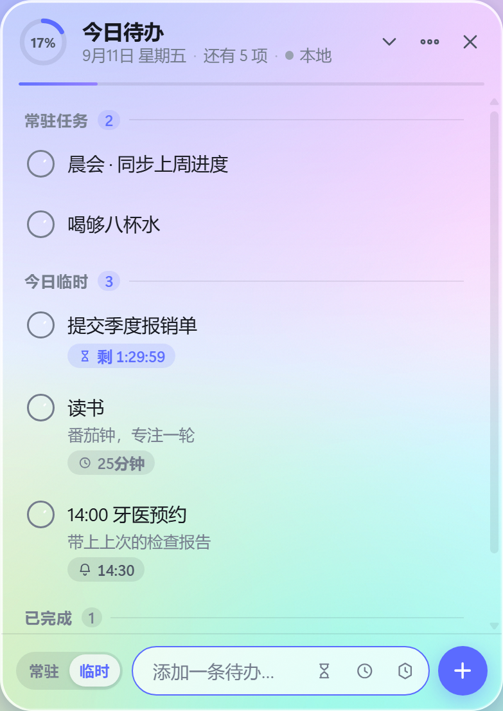
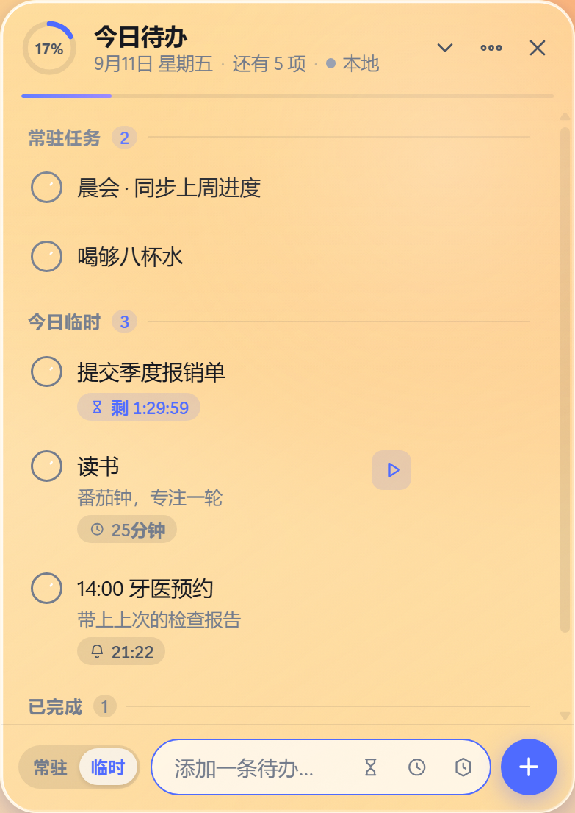
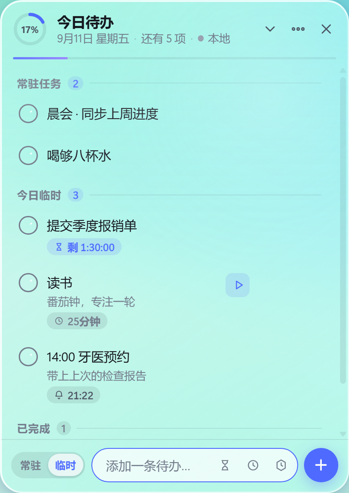
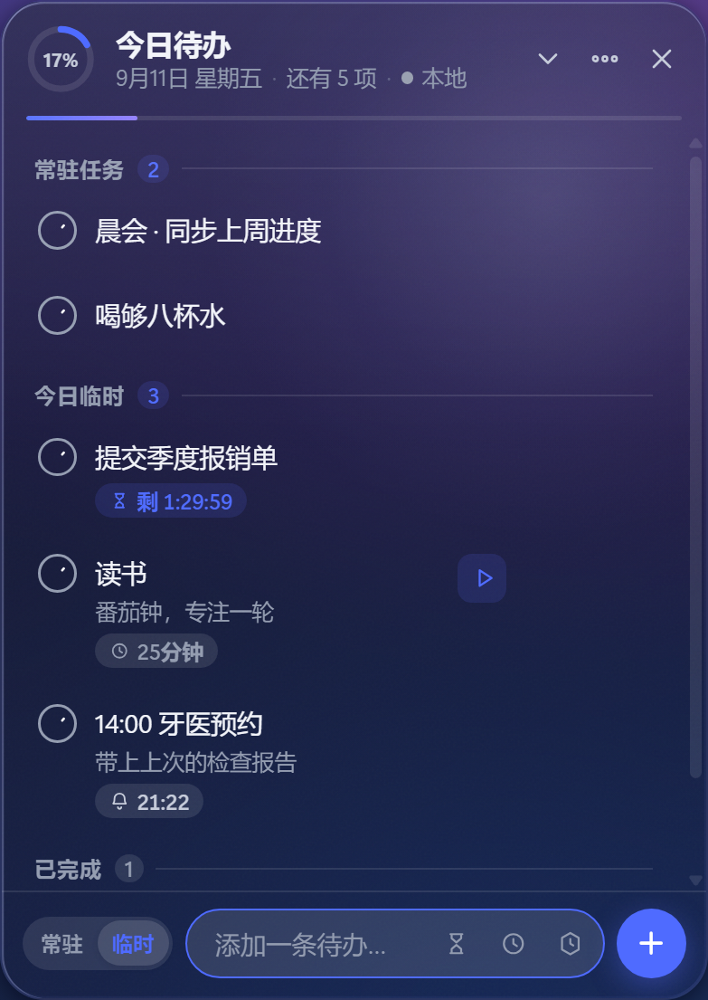
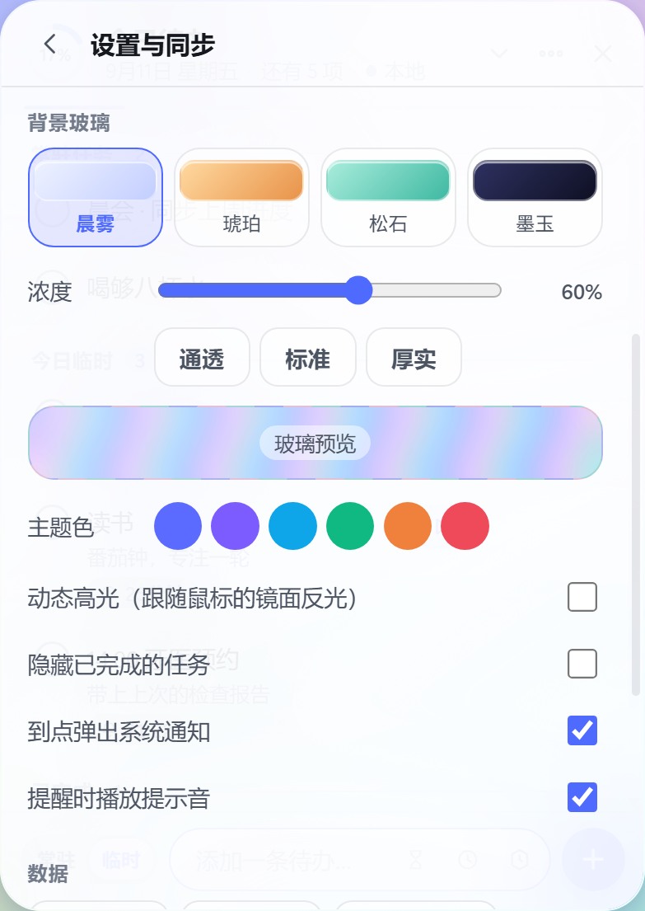

# Onederz · 跨平台桌面悬浮待办

> 悬浮在桌面上的待办集 / 备忘录。常驻任务添加一次每天自动出现，临时任务仅当日有效，
> 电脑、平板、手机用同一账号登录即看到同一份待办，一端勾选全端同步。

支持 **Windows（Electron 桌面部件）** 与 **Android（Capacitor App + 原生悬浮窗）**，
另附**浏览器 PWA** 作为零安装通道。

---

## 界面一览

| 浅色玻璃（晨雾预设） | 深色玻璃（墨玉预设） |
|:---:|:---:|
|  |  |

| 浓度可调：通透档（12%） | 外观预设：琥珀 |
|:---:|:---:|
|  |  |

| 外观预设：松石 | 外观预设：墨玉 |
|:---:|:---:|
|  |  |

| 设置面板：背景玻璃（浓度 / 预设 / 动态高光） |
|:---:|
|  |

> 以上均为真实渲染截图（Electron `capturePage`，非设计稿 mock）。

---

## 需求对照

| # | 需求 | 实现 |
|---|---|---|
| 1 | 悬浮桌面，打开其他应用时自动隐藏于下方，显隐逻辑与系统桌面部件一致 | 默认「跟随桌面显示 / 隐藏」：前台是桌面时出现，打开其他应用或网页时自动隐藏，与系统桌面部件的出现时机一致。托盘 / 设置里可切 4 种层级（含一直最底层、始终置顶） |
| 2 | 拖拽移动 / 缩放；磨砂玻璃背景透出壁纸；圆角矩形 | 无边框透明窗口 + `SetWindowCompositionAttribute` 亚克力磨砂 + DWM 系统级圆角；自定义顶部拖拽与八向缩放，位置尺寸持久化。玻璃浓度可调、浅色/深色两组玻璃（见下） |
| 3 | 常驻任务（添加一次每日自动出现）与临时任务（仅当日有效） | `type: daily / temp`，底部「常驻 / 临时」切换 |
| 4 | 勾选完成 / 编辑 / 删除 / 提醒时间 / 倒计时；每日凌晨重置与清理 | 全部实现；跨天重置采用**日期推导**而非定时清零，零点自动生效、离线设备次日打开也对 |
| 5 | Windows 与安卓数据同步，一端标注完成全端更新 | 自建同步服务（HTTP 增量同步 + WebSocket 实时推送），LWW 冲突合并 |

---

## 快速开始

> **所有命令都要在项目根目录执行**（也就是本 README 所在的目录）。
> 在别的目录跑 `npm run setup` 会报 `ENOENT: Could not read package.json`。

### 方式一：双击启动（推荐）

直接双击项目根目录下的 **`启动 Onederz.cmd`**。
它会自动切到项目目录、首次运行自动装依赖，然后把同步服务和桌面部件一起拉起来。
Ctrl+C 或关闭窗口即一起退出。

远程桌面 / 虚拟机 / 显卡驱动异常导致部件起不来时，用 **`启动 Onederz（无 GPU）.cmd`**。

### 方式二：命令行

```bash
cd /d C:\Users\Lenovo\WorkBuddy\Onederz   # ← 换成你的实际路径

npm run setup      # 1) 安装依赖（首次运行，约 1-3 分钟）
npm start          # 2) 一条命令同时启动同步服务 + 桌面部件
```

`npm start` 的输出会带 `[同步]` / `[桌面]` 前缀，同步服务启动时会打印局域网地址，
例如 `http://192.168.1.10:8787` —— **手机端要填的就是这个地址**。

也可以分开跑：`npm run server` 和 `npm run desktop`（两个终端窗口）。

首次使用：在部件右上角 **⋯ → 设置与同步** 里填入服务器地址，注册一个账号。
手机端用**同一个账号登录**，两端即自动双向同步。

> 只想先看看界面？`npm run preview` 会在 http://127.0.0.1:4317 起一个本地预览，
> 用手机浏览器打开局域网地址还能「添加到主屏幕」当作 PWA 直接用。

---

## 目录结构

```
Onederz/
├── 启动 Onederz.cmd             ★ 双击启动（自动装依赖 + 拉起前后端）
├── 启动 Onederz（无 GPU）.cmd    远程桌面 / 虚拟机用
├── app/                  共享前端（三端复用同一份，零分支）
│   ├── lib/model.js      ★ 数据模型与业务规则（每日重置 / 过期 / 倒计时 / 冲突合并）
│   ├── lib/sync.js       同步引擎（离线队列 + WebSocket 实时推送）
│   ├── lib/store.js      本地持久化
│   ├── lib/notify.js     系统通知 / 提示音 / 触感
│   ├── ui/render.js      列表渲染
│   ├── ui/panels.js      设置面板（同步 / 背景玻璃 / 桌面行为 / 悬浮窗 / 数据）
│   ├── app.js            主控制器（含玻璃浓度的两层分工 glassLayers）
│   ├── index.html, styles.css   磨砂玻璃界面
│   └── manifest.webmanifest      PWA 清单
├── desktop/              Windows 外壳（Electron）
│   ├── src/main.js       窗口 / 托盘 / 热键 / 拖拽缩放 / 层级维持
│   ├── src/win32.js      ★ 原生能力：亚克力磨砂、DWM 圆角、WorkerW 桌面层
│   ├── src/preload.js    最小权限的原生能力桥
│   ├── src/config.js     窗口配置持久化
│   └── scripts/launch-nogpu.js   软件渲染启动器 + 自检入口
├── server/               同步服务（Express + ws + JSON 存储，零原生依赖）
├── mobile/               Android 外壳（Capacitor）
│   ├── capacitor.config.json
│   └── android-overlay/  ★ 原生悬浮窗源码（含集成脚本）
├── tools/static-server.js   极简静态服务（Electron 与预览共用）
├── docs/                 架构说明与界面截图
└── scripts/              start-all / 图标生成 / 资源同步 / 冒烟测试 / Android 集成
```

---

## 核心设计：为什么「每日重置」不需要定时任务

常驻任务的完成状态不存布尔值，而是存**完成于哪一天**：

```js
doneDate === 今天   // 才算"今天完成了"
```

于是零点一到，日期变了，所有常驻任务自动回到未完成 —— 不需要定时器清零、
不需要写回数据、也不需要把这个"重置事件"同步给其他设备。
离线三天的设备再打开，状态也是对的。临时任务的过期同理：`date < 今天` 即过期。

这一条让同步层完全不用处理跨天冲突，是整个项目最省心的地方。

## 核心设计：多端一致性

- 每次本地改动进入 **outbox**，联网后批量上行；
- 服务端按 `updatedAt` 做 **Last-Write-Wins** 合并，时间相同时**删除优先**（墓碑不会复活），
  再相同则比 `deviceId`，保证多端结果确定性一致；
- 服务端合并后通过 **WebSocket** 广播给同一账号的其他设备，毫秒级刷新；
- 拉取时带 5 秒回拨窗口，抵消各端时钟微差造成的漏拉。

---

## 键盘与操作

| 操作 | 方式 |
|---|---|
| 添加 | 底部输入框回车，或点 `+`；带时长就写 `读书 一小时` |
| 完成 | 点左侧圆圈 |
| 编辑 | 点标题文字，回车保存 / Esc 取消 |
| **开始 / 停止计时** | 设了时长的任务上常显 **▶ / ⏹** |
| 提醒 / 倒计时 / 时长 | 悬停任务行右侧的 🔔 / 🕐 / ⏳ 图标 |
| 移动窗口 | 拖标题栏中部（靠近边缘 6px 是缩放区，四角 16px 是角缩放） |
| 缩放窗口 | 拖窗口八条边 / 四个角 |
| 显示隐藏 | 全局热键 `Alt+Space`，或托盘图标 |
| 新增快速聚焦 | 按 `n` |

---

## 时长任务：设个时长，点开始，到点自动完成

适合"读书 一小时""冥想 15 分钟"这类**做一段时间**的事。

1. **添加时带上时长**。两种写法：
   - 底部输入框直接写 `读书 一小时`、`跑步30分钟`、`阅读 1.5小时` —— 会自动识别并从标题里去掉；
   - 或点输入框右侧的 ⏳ 图标，从 15 分钟 / 25 分钟 / 45 分钟 / 1 小时 / 90 分钟 / 2 小时里选，或自填分钟数。
2. 任务上会出现「⏱ 25分钟」的预告徽标，以及常显的 **▶** 按钮。
3. **开始做事时点 ▶** —— 以当下为起点开始倒数，任务进入"计时中"：
   整行微微提亮、下方出现一条进度线，剩余时间实时跳动。
4. **到点自动标记完成**，并弹通知 + 提示音（可在设置里关）。

补充说明：

- 手动设的「倒计时」**不会**触发自动完成 —— 只有按过 ▶ 的才算"开始做过"，
  这样你给某件事设一个硬性截止时间（比如"18:00 前交"）也不会被误标成完成。
- 点 ⏹ 停止计时会**保留剩余时长**，下次接着用。
- 计时状态会同步到其他设备，换台电脑接着做也行。

---

## 背景玻璃（预设 + 浓度可调 + 动态高光）

**设置 → 背景玻璃**。点一个预设就是一整套调好的观感（玻璃基色 + 主题色 + 浓度），
之后仍可用浓度滑块和主题色微调。

| 预设 | 观感 |
|---|---|
| **晨雾** | 雾蓝白玻璃、靛蓝主题色、60% —— 日常默认 |
| **琥珀** | 琥珀暖金玻璃、焦糖主题色、62% —— 暖色调壁纸 |
| **松石** | 松石青玻璃、青绿主题色、60% —— 清爽系 |
| **墨玉** | 深靛蓝玻璃、紫罗兰主题色、78% —— 深色环境 / 夜间 |

| 控件 | 说明 |
|---|---|
| **浓度** | 8% – 96% 连续可调，右侧实时回显百分比；另有通透 / 标准 / 厚实三档（18% / 55% / 86%） |
| **主题色** | 六色可选，影响勾选、进度线与强调元素 |
| **动态高光** | 跟随鼠标的镜面反光，玻璃"被光照到"的生命感（可关） |
| **玻璃预览** | 面板里的一小块样品，拖滑块时即时变化 —— 不用去找被面板挡住的部件本体 |

一个滑块要在三端都调出正确观感，关键是分清"谁承担不透明度"：

- **Windows 桌面端**：系统亚克力本身就是这块面板的填充，滑块 **1:1 映射到亚克力的 alpha**，
  **玻璃基色也一并传给亚克力**（`GradientColor`）。之前基色没传，亚克力永远只有白/深灰两种，
  于是切预设时"只有按钮变色、面板不变色" —— 已修正。
- 页面那层只留约 5%–15% 的极薄色膜。两层各调各的会变成"雾上加雾"，
  而且早先的映射方向是反的（越往通透调系统那层反而越厚），已修正。
- **浏览器 / Android**：没有系统级模糊，页面这层就是全部，滑块直接映射到自身 alpha；
  环境光底色也会跟着预设换（`body[data-theme]`），否则看不出预设之间的差别。
- **顶部高光**也随浓度同向变化：玻璃厚则高光明显，玻璃透则高光收敛，
  避免在通透档位糊上一层白纱。

调完会同时写进 `localStorage` 和桌面外壳的配置，下次启动保持一致。

### 让磨砂"高级"而不是"廉价"的几个关键

照着 2026 年玻璃拟态（Glassmorphism 2.0 / Liquid Glass）的共识做法逐项落地：

| 手法 | 作用 |
|---|---|
| **细颗粒噪点**（SVG feTurbulence 叠加层，`mix-blend-mode: overlay`） | 纯半透明色块 + 模糊会像塑料贴膜；一层极淡的胶片颗粒让玻璃有真实材质触感。这是"高级"与"廉价"的分水岭 |
| **动态高光**：跟随鼠标的径向光斑（`mix-blend-mode: screen`） | 玻璃不再是静态贴图，而是会响应的材质；尊重 `prefers-reduced-motion` 自动关闭 |
| **模糊半径 18px + saturate(160%) + brightness(1.05)** | 过重会把背景搅成浆糊；中等模糊配上饱和度提升才是"透镜感"，颜色从玻璃后透出来更鲜亮 |
| **受光边**：上/左 1px 亮、下/右 1px 暗（`inset box-shadow`） | 玻璃棱边会反光，这 1px 让大脑立刻锁定表面边界，也顺带解决了可读性 |
| **渐变方向 145°**（左上亮 → 右下暗） | 模拟真实光源，产生"玻璃有厚度"的感觉 |
| **深色玻璃用深靛蓝而非白/灰** | 用白/灰调深色玻璃会发灰发脏（grey wash），偏蓝紫才保得住大气层次 |
| **带主题色的投影** | 影子不用纯黑而用环境色，玻璃才像悬浮在环境里而不是贴在墙上 |
| **`prefers-reduced-transparency` 回退** | 系统开了"减少透明度"时自动退回实色高对比，保证可读性 |

---

## Windows 端四种显示层级

在 **设置 → 桌面部件行为** 或 **托盘右键 → 显示层级** 里切换：

| 模式 | 行为 |
|---|---|
| **跟随桌面显示 / 隐藏**（默认） | 前台窗口是桌面（或开始菜单、任务栏）时出现，打开其他应用或网页时自动隐藏 —— 与系统桌面部件的出现时机一致 |
| **普通窗口 · 一直显示在最底层** | 一直可见，但周期性压回最底层，永远被其他窗口盖住，不抢焦点、不占任务栏 |
| **始终置顶** | 一直浮在最上面 |
| **桌面层挂载**（实验性） | 把窗口 `SetParent` 到桌面壁纸层 `WorkerW`。**在 Electron 透明窗口上不可靠**，详见下方说明；程序会自校验，失败自动回落到「跟随桌面显示 / 隐藏」 |

### 关于「桌面层挂载」为什么不可靠

Windows 上 Electron 的透明窗口会存在**两个** `Chrome_WidgetWin_1`：
`getNativeWindowHandle()` 返回的那个并不承载页面内容，
真正显示内容的是 `WindowFromPoint` 命中的 `Chrome_RenderWidgetHostHWND` 所属的另一个窗口。
对前者调用 `SetParent` 会正常返回成功，但**内容窗口的位置和层级毫无变化** —— 看起来"挂载成功"，实际什么都没发生。

程序现在会用**内容窗口的祖先链**复核挂载结果，失败就自动回落并告知，
而不是像早期版本那样拿 `SetParent` 的返回值当成功证据。
加上 WorkerW 在部分系统/远程桌面会话里本就不可用，这条路径不作为默认方案。

> 「跟随桌面显示 / 隐藏」与桌面层模式对用户而言可见行为一致：打开其他应用时隐藏、回到桌面时出现。
> 按 `Win+D` 或点桌面即可看到部件；`Alt+Space` 可随时强制显隐。

## Android 端两种形态

1. **常规 App**：直接用 Capacitor 打包，界面与 Windows 完全相同（自适应触屏），
   数据通过同步服务与电脑互通。
2. **桌面悬浮窗**（可选增强）：原生 `TYPE_APPLICATION_OVERLAY` 服务，
   让待办浮在手机桌面上、盖在其他 App 之上；拖动顶部条移动、拖右下角缩放。
   Android 12+ 使用系统窗口级模糊（`FLAG_BLUR_BEHIND`），磨砂质感与 PC 端一致。

   悬浮窗里的 WebView 与主界面**同源**（都是 `https://localhost`），
   因此共用同一份 localStorage，不会出现"两个界面数据不一致"。

---

## 测试

```bash
npm test              # 业务规则 + 多端同步，40 项断言
npm run test:desktop  # 桌面端端到端交互（真起 Electron 窗口点一遍），38 项断言
```

`npm test` 覆盖：每日自动重置、临时任务跨天清理、分组排序、倒计时文案、提醒触发条件、
LWW 冲突合并、账号鉴权、A 端改动 → B 端可见 → 反向同步 → 删除同步。
`npm run test:desktop` 额外覆盖：磨砂与圆角施加、玻璃浓度两层分工、亮暗切换、
时长任务全流程（添加 ▶ 开始 → 到点自动完成）、跨天重置、过期清理、
设置面板滑块实时生效（不重建 DOM）等。

> 远程桌面 / 虚拟机 / 无 GPU 环境下 Electron 会因 GPU 进程起不来而退出，
> 用 `npm run desktop:nogpu` 以软件渲染启动。

---

## 常见问题

**`npm error ENOENT: Could not read package.json`**
命令跑错目录了。先 `cd` 到项目根目录（本 README 所在目录），或直接双击 `启动 Onederz.cmd`。

**`npm install` 卡在 Electron 下载 / 报 ETIMEDOUT**
Electron 的二进制默认从 GitHub 拉，国内常超时。
项目已在 `desktop/.npmrc` 预设了国内镜像（npmmirror），正常情况下不会再遇到；
若仍失败，手动补下：

```bat
cd desktop
node node_modules\electron\install.js
```

海外环境或想用公司内网镜像，改 `desktop/.npmrc` 里的 `electron_mirror` 即可。

**看不到部件？**
默认是「跟随桌面显示 / 隐藏」模式 —— 你正开着别的窗口时它本来就该隐藏。
按 `Win+D` 回到桌面，或按 `Alt+Space` 强制显隐，也可以点系统托盘里的 Onederz 图标。
想让它一直可见，切到「普通窗口 · 一直显示在最底层」。

**启动后终端报 GPU 相关错误、窗口一闪就没了？**
用 `启动 Onederz（无 GPU）.cmd`，或在项目目录跑 `npm run start:nogpu`。

**手机连不上电脑的同步服务？**

按顺序查这几点：

1. **手机与电脑在同一 WiFi**（手机开热点给电脑也行，但地址要用热点的网段）
2. 手机端设置里填的是**电脑的局域网 IP**（启动时会打印，例如 `http://192.168.1.10:8787`）
   —— 不是 `127.0.0.1`，那在手机上指手机自己
3. **同步服务在运行**：桌面部件会**自动托管**它（启动日志有 `[server] 同步服务状态`），
   或双击 `启动 Onederz.cmd` 一并拉起
4. **Windows 防火墙放行 8787**（首次连接弹窗要选"允许"）
5. 手机端要装**允许明文 HTTP 的构建**：Android 9+ 默认禁止 `http://`，
   项目已通过集成脚本在 Manifest 注入 `android:usesCleartextTraffic="true"`，
   请用 CI 构建的 APK（旧包会表现为"点登录没反应"）

> 登录/注册失败时，设置面板里会直接显示失败原因（服务器地址一并回显），
> 同时右下角弹一条提示 —— 不会静默无反应。

**想部署到公网？**
`server/` 是零原生依赖的 Node 服务，直接丢到任意支持 Node 的服务器即可。
生产环境建议配置 `ONEDERZ_SECRET` 环境变量（否则密钥会生成在 `server/data/.secret`），
并在前面加一层 HTTPS 反向代理。

**桌面层挂不上？**
这不是异常，是 Electron 透明窗口的固有限制（原因见上文），默认模式本就不依赖它。
「跟随桌面显示 / 隐藏」的可见行为一致。

---

## 技术栈

Electron 44 · Capacitor 6 · Express 4 · ws 8 · 原生 ES Module 前端（零框架、零构建）
Win32 原生调用通过 PowerShell + 内联 C# 完成，**不引入任何需要重编译的原生 npm 模块**。

依赖安全：`npm audit` 在 `server/` 与 `desktop/` 均为 0 漏洞
（`server` 用 `overrides` 把 express 间接依赖的 `qs` 顶到已修复版本）。

MIT License
